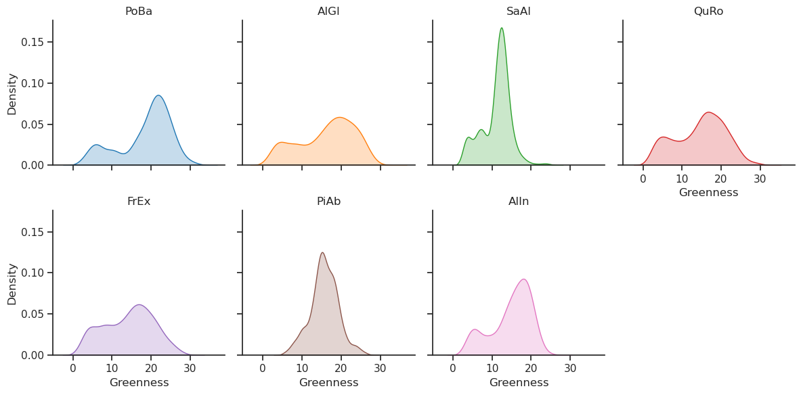
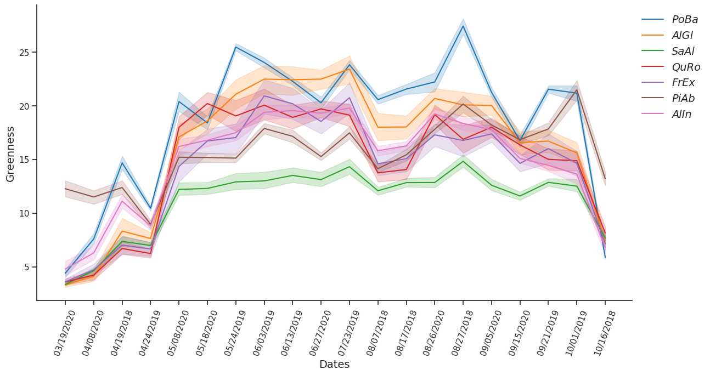
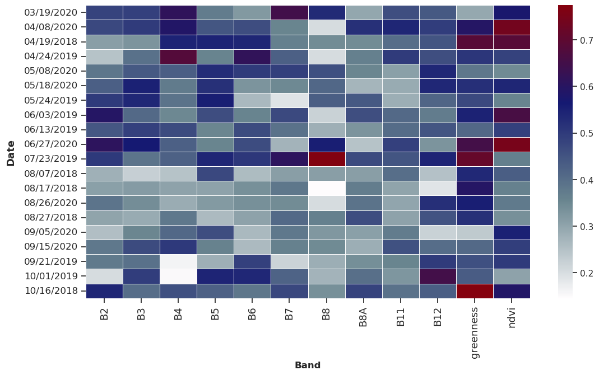
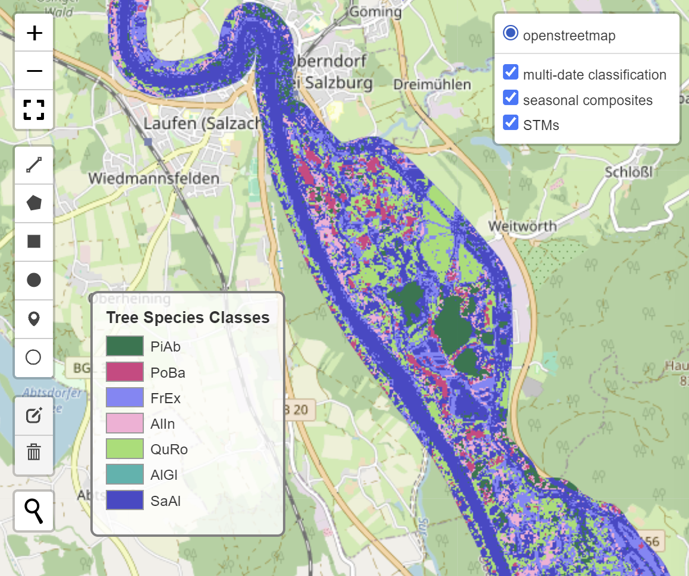

# README.md

## Repository Overview
This project provides a framework for multitemporal tree species classification with Google Earth Engine (GEE) using the Python API. It allows the use and comparison of three main multitemporal approaches used for three species classification: (i) combining all available single-date images in one multidate stacked image (ii) combining seasonal mean composites and (iii) calculation of spectral-temporal metrics (STMs). The main workflow for the analyses is written down in a Jupyter notebook: `main.ipynb`, while all custom functions created for the task of three species classificiation are stored in a separate file: `functions.py`. 

This repository allows the users to explore their tree species reference data through visualization of vegetaion indexes time-series and destribution. It also outputs classification maps of the chosen multitemporal approach, confusion matrixes and feature importance plots.
<table style="border-collapse: collapse; border: none;">
    <tr>
        <td>
             
            <small><b>Fig :</b> Distribution of Greenness values for each tree species</small>
        </td>
        <td>
             
            <small><b>Fig :</b> Time series of tree species Greenness values </small>
        </td>
    </tr>
    <tr>
        <td>
             
            <small><b>Fig :</b> Feature importance plot</small>
        </td>
        <td>
             
            <small><b>Fig :</b> Tree species classification map</small>
        </td>
    </tr>
</table>

## Prerequisites

Before running the notebook, ensure you have an account for Google Earth Engine (GEE). Creating an account is free for research purposes: https://earthengine.google.com

## Data Input
The data needed for analyses to run is: 
1. Cloud and snow-free __Sentinel-2 image collection__ (Surface Reflecation). We have provided a list of cloud and snow-free images which are used as a demo to run the analyses and are being accessed using the `import_dates_list ()` function.

2. Tree species __training and testing__ points provided as a GEE asset. Note that the label of the tree species classes needs to be numeric, GEE does not accept other variable types to train and test Machine Learning models. There should not be more than one point in a single 10m S2 pixel and each pixel needs to represent one tree species, meaning at least 50% of the pixel area have to be covered by trees of the particular species. Demo data is provided as GEE assets in the main workfflow.
3. Polygon with the __area of interest__. Demo data is provided as GEE assets in the main workfflow.

## Jupyter Notebook Flow
The Jupyter notebook `main.ipynb` is devided into sections to guide you throughout the tree species classification workflow used in this research:

0. __Prerequisites:__ Run this section to import all necessary lybraries and data required. Here, authentication and initialization of GEE Python API is done. DEMO AOI and reference data points are imported from GEE assets. An example list of cloud-free images is provided with the function  `import_dates_list` 
1. __Image collections and stacked images:__ In this section an initial image collection is created. Vegetatin indexes (NDVI and Greenness) are added for each image of the collection using the `addIndeces` function.  After that a multiband stacked image is created for each of the three multitemporal classification approaches with the `collectionToStackImage` function.
2. __Visualiza the data (optional):__
Here time-series and destribution plots are created for the tree reference data provided. First a pandas dataframe is defined to represent timeseries of a chosen band, using the `create_pd_df` function. Then the `plot_timeseries` function is used to produce the graphs.
3. __Tree species classification:__ Train and apply a Random Forest model corresponding to each multitemporal approach using `random_forest_classification` function. Results are desplayed on interactive map and can be exported to a .tif format. In addition confusion matrixes and feature importance plots are created with the functions `accuracy_assesment`, `plot_confmatrix` and `plot_importance`.

4. __Statistics:__ In order to statistically compare the accuracy of the different multitemporal approaches, we use the McNemar's Test.

5. __Single image classification__ allows the comparison between the multitemporal approaches and the single date classification approach
